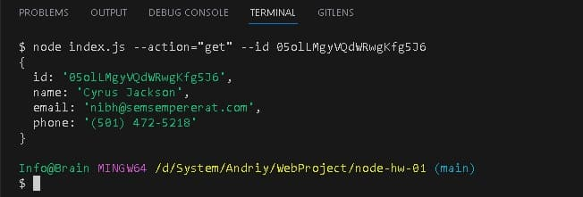

# Виконання завдання

```
## Отримуємо і виводимо весь список контактів у вигляді таблиці (console.table)

node index.js --action="list"
```


```
## Отримуємо контакт по id

node index.js --action="get" --id 05olLMgyVQdWRwgKfg5J6

```



```
## Додаємо контакт

node index.js --action="add" --name Mango --email mango@gmail.com --phone
322-22-22
```


```
## Видаляємо контакт

node index.js --action="remove" --id qdggE76Jtbfd9eWJHrssH
```


